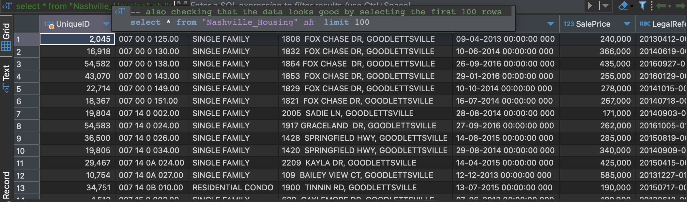
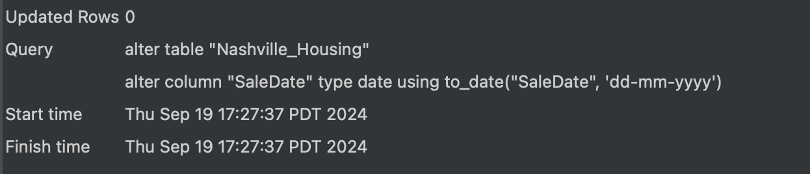
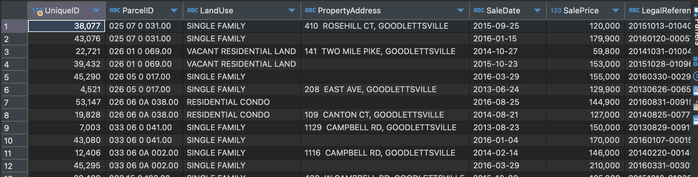

# Nashville Housing Data Cleaning Project

## Overview
This project focuses on cleaning and preparing a Nashville housing dataset using SQL. The goal is to transform raw data into a more usable format for analysis, demonstrating various data cleaning techniques.  
The list of all SQL queries used for this project can be found [here](https://github.com/mboss10/Nashville-Housing-Data-Cleaning-Project/blob/main/output%20files/Nashville_housing_cleaning.sql)

## Dataset
The dataset contains information about housing sales in Nashville, including details such as sale date, property address, sale price, and more.  
The dataset file can be found [here](https://github.com/mboss10/Nashville-Housing-Data-Cleaning-Project/blob/main/sources/Nashville%20Housing%20Data%20for%20Data%20Cleaning%20(reuploaded).csv)

I imported the data into a table called `Nashville_Housing` on my local machine Postgres DB.

## Cleaning Process

### 1. Data Validation
- Verified the correct number of rows (56,477) were imported from the source file.

```
select count(*) from "Nashville_Housing" nh
```

</img>

- Performed an initial check of the data by selecting the first 100 rows.

```
select * from "Nashville_Housing" nh  limit 100
```

</img>

### 2. Standardizing Date Format
- Converted the `SaleDate` column from varchar to date format.

```
alter table "Nashville_Housing" 
alter column "SaleDate" type date using to_date("SaleDate", 'dd-mm-yyyy')
```

</img>

### 3. Handling Missing Property Addresses
- Identified records with empty `PropertyAddress` fields.

```
with cte_id_for_address_empty as (
	select 
		nh."ParcelID"
	from
		"Nashville_Housing" nh 
	where 
	"PropertyAddress" = ''
)
select	
	*
from 
	"Nashville_Housing" nh
inner join
	cte_id_for_address_empty cte on nh."ParcelID" = cte."ParcelID"
order by 
	nh."ParcelID"
```

</img>
  
- Populated missing addresses using data from records with the same `ParcelID`.

```
update "Nashville_Housing" nh
set "PropertyAddress" = nh2."PropertyAddress" 
from
	"Nashville_Housing" nh2 
where  
	nh."ParcelID" = nh2."ParcelID" 
	and nh."UniqueID " <> nh2."UniqueID " 
	and nh."PropertyAddress" = ''
```

</img>


### 4. Breaking Out Address Information
- Split `PropertyAddress` into separate columns for address and city.
- Split `OwnerAddress` into separate columns for address, city, and state.

### 5. Standardizing Field Values
- Standardized the `SoldAsVacant` field to consistently use 'Yes' and 'No' instead of 'Y' and 'N'.

### 6. Removing Duplicates
- Identified and removed duplicate entries based on `ParcelID` and `SaleDate`.

### 7. Creating a Clean View
- Created a view `v_nashville_housing` that includes only the relevant and cleaned columns.

## SQL Techniques Used
- Data type conversion
- String manipulation (SUBSTRING, STRPOS, SPLIT_PART)
- Self joins for data population
- CASE statements
- Window functions (ROW_NUMBER)
- CTEs (Common Table Expressions)
- View creation

## Conclusion
This project demonstrates various SQL data cleaning techniques, preparing the Nashville housing dataset for further analysis. The cleaned data is more consistent, properly formatted, and free of duplicates, making it suitable for accurate insights and reporting.

## Next Steps
- Perform exploratory data analysis on the cleaned dataset.
- Create visualizations to better understand housing trends in Nashville.
- Develop predictive models for housing prices using the cleaned data.
